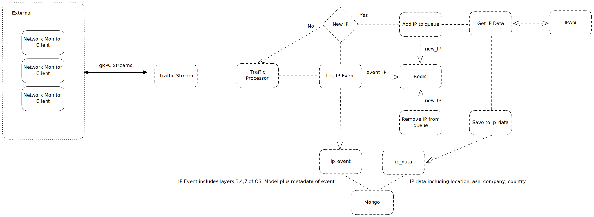

# go-network-monitor

A server that receives pcap events via
[go-network-monitor-client](https://github.com/shammalie/go-network-monitor-client).
Client events are sent to the server for processing and collection:

- ip_event is the pcap detail which includes OSI layers; 3, 4 and 7.
- ip_data contains lookup information of the layer 3 source IP, lookup consumes
  [ipapi](https://ipapi.co/api/?go#complete-location) service.

These events are stored in MongoDB, the primary database used by this service.

IP lookup only occurs with new IP's that haven't been recorded yet, the service
uses Redis to cache new IP addresses as the service processes them. Since this service uses
the free version of ipapi, caching new IP's is required when the lookup service is rate limited.

## Usage

## Future work

- [ ] Add support for client api keys
- [ ] Create seperate gRPC streams for clients and groups of clients
- [ ] Create decisions for ip events
- [ ] Enable decision making for group of clients
- [ ] Add Tests and benchmarks
